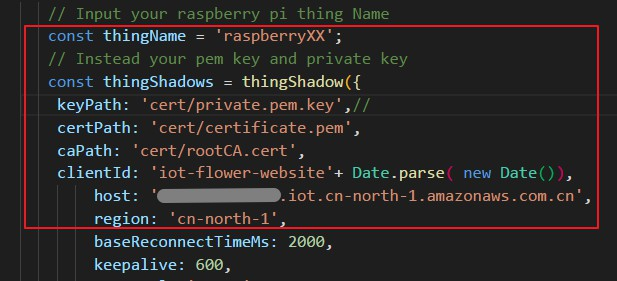

# IoT动手实验 - 树莓派控制

**运行该项目前请先完成 https://github.com/cncoder/aws-iot-raspberrypi**

## 远程查看传感器数据并控制设备

启动一台AWS EC2，Linux或者Windows Server 都可以，并在安全组打开80以及22端口，安装Nodejs 环境。以下笔者启动的是一台Amazon Linux，安装Nodejs 步骤：

我们将使用 nvm 来安装Node.js，而且 nvm 可以安装多个版本的 Node.js 并允许您在它们之间切换。

```
curl -o- https://raw.githubusercontent.com/creationix/nvm/v0.33.8/install.sh | bash
```

在命令行键入以下命令来激活 nvm

```
. ~/.nvm/nvm.sh
```

安装Node.js 8 版本

```
nvm install 8
```

通过在命令行输入以下内容来测试Node.js是否已正确安装并正常运行。

```
node -e "console.log('Running Node.js ' + process.version)"
```

下载Web页面控制代码，并安装依赖

```
git clone https://github.com/cncoder/webserver-iotCtl-raspberrypi.git

cd webserver-iotCtl-raspberrypi/cert

npm install
```

我们建议您为每个设备或者服务器提供一个唯一的证书，以便进行精细的管理，包括证书吊销。所以在这一节中，也需要注册设备并设置好证书，最后把证书放到cert目录。同样的您可以使用第一节的方法注册证书。
创建安全策略(**raspberryXX**):

策略名称输入webserver，在此服务器不需要创建事物。

```
aws iot create-policy --policy-name "webserver" --policy-document '{"Version": "2012-10-17","Statement": [{"Effect": "Allow","Action": "iot:*","Resource": "*"}]}'
```

使用AWS Cli创建设备证书，激活并记录控制台返回的证书 ARN (certificateArn)

```
aws iot create-keys-and-certificate --set-as-active --certificate-pem-outfile certificate.pem --private-key-outfile private.pem.key | grep certificateArn
```

为证书附加安全策略，不需要附加设备影子了，这里的—principal替换成上一步记录下来的证书ARN, --policy-name使用您自己的编号

```
aws iot attach-principal-policy --policy-name "webserver" --principal arn:XXXXX:XXXXX:cert/XXXXXXXX
```

下载 AWS IoT 平台 CA 证书

```
wget -cO- https://www.symantec.com/content/en/us/enterprise/verisign/roots/VeriSign-Class%203-Public-Primary-Certification-Authority-G5.pem > rootCA.cert
```

编辑 mobileserver.js 文件，修改其中thingname，以及endpoint。

**thingname: 'raspberryXX'**

**host: 'XXXX.iot.cn-north-1.amazonaws.com.cn'**



保存并运行mobileserver.js 文件

```
node mobileserver.js
```

此时您可以通过电脑浏览器访问您服务器的ip地址，进行远程查看传感器数据并控制设备了。

